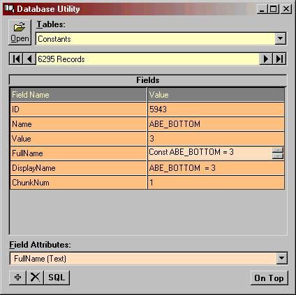



## Access Database Utility

### Description

Analyse Access Database Tables and Fields and optionally alter contents.
 
### More Info
 

             |
---                |---
**Submitted On**   |2001-09-02 16:11:50
**By**             |[ULLI](https://github.com/Planet-Source-Code/PSCIndex/blob/master/ByAuthor/ulli.md)
**Level**          |Advanced
**User Rating**    |4.8 (43 globes from 9 users)
**Compatibility**  |VB 6\.0
**Category**       |[Complete Applications](https://github.com/Planet-Source-Code/PSCIndex/blob/master/ByCategory/complete-applications__1-27.md)
**World**          |[Visual Basic](https://github.com/Planet-Source-Code/PSCIndex/blob/master/ByWorld/visual-basic.md)
**Archive File**   |[Access Dat25780922001\.zip](https://github.com/Planet-Source-Code/ulli-access-database-utility__1-26908/archive/master.zip)

